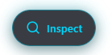
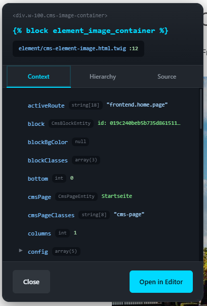
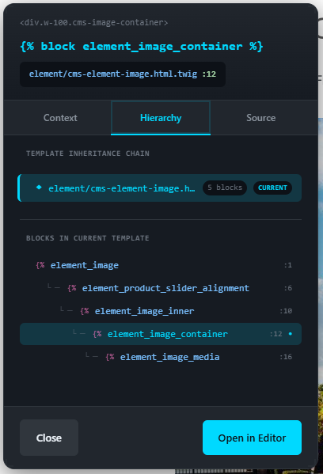
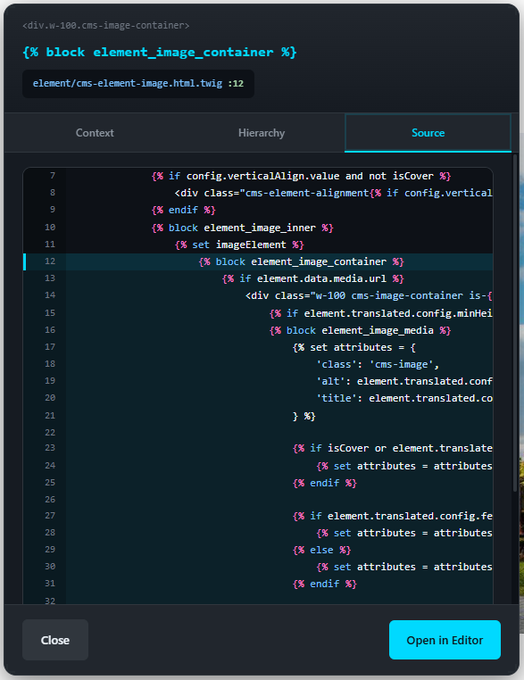

# MNKYS DevTools for Shopware 6

> Vue DevTools-inspired component inspector for Shopware 6 Twig templates

<p align="center">
  
</p>

Instantly identify which Twig block renders any element on your storefront. Hover to inspect, click to dive deep into template hierarchy, context variables, and source code. Open files directly in your favorite editor with a single click.

---

## Features

- **Component Picker** - Hover over any element to see which Twig block rendered it
- **Block Inspector** - Click to view detailed information about any block
- **Template Hierarchy** - Visualize the complete template inheritance chain
- **Context Variables** - Explore all Twig variables available in the block's scope
- **Source Code View** - See the actual Twig source with syntax highlighting
- **Editor Integration** - Open files directly in VS Code, PHPStorm, Sublime, or other editors
- **Block List Panel** - Browse all Twig blocks on the current page
- **Resizable Panels** - Drag to move and resize inspector panels to your preference
- **Dark Theme** - Modern, polished UI with glassmorphism effects

## Requirements

- Shopware 6.6.x or 6.7.x
- PHP 8.1+
- `APP_ENV=dev` (plugin is automatically disabled in production)

## Installation

### Via Composer (Recommended)

```bash
composer require mnkys/devtools --dev
bin/console plugin:refresh
bin/console plugin:install --activate MnkysDevTools
```

### Manual Installation

1. Download or clone this repository
2. Copy the `plugin` folder to `custom/plugins/MnkysDevTools`
3. Run the following commands:

```bash
bin/console plugin:refresh
bin/console plugin:install --activate MnkysDevTools
bin/console cache:clear
```

## Configuration

Configure the plugin in the Shopware Administration under:

**Settings → System → Plugins → MNKYS DevTools → Configure**

| Option | Description | Default |
|--------|-------------|---------|
| **Enable DevTools** | Toggle the inspector on/off | `true` |
| **Editor** | Your preferred code editor | `vscode` |
| **Open via Command** | Execute shell command to open editor (more reliable) | `false` |
| **Max Variable Depth** | How deep to inspect nested objects | `3` |

### Supported Editors

| Editor | Protocol | Command |
|--------|----------|---------|
| VS Code | `vscode://file/{path}:{line}` | `code --goto "{path}:{line}"` |
| PHPStorm | `phpstorm://open?file={path}&line={line}` | `phpstorm --line {line} "{path}"` |
| Sublime Text | `subl://open?url=file://{path}&line={line}` | `subl "{path}:{line}"` |
| IntelliJ IDEA | `idea://open?file={path}&line={line}` | `idea --line {line} "{path}"` |
| Atom | `atom://core/open/file?filename={path}&line={line}` | - |

## Usage

### Activating the Inspector

1. Look for the **MNKYS** toggle button in the bottom-left corner of your storefront
2. Click to activate the component picker
3. Press `Escape` to deactivate

### Inspecting Elements

1. **Hover** over any element to see a tooltip with the block name and template path
2. **Click** on an element to open the detail panel with:
   - **Context Tab** - All Twig variables available in this block
   - **Hierarchy Tab** - Template inheritance tree showing extends/overrides
   - **Source Tab** - Highlighted source code of the block
3. Click **"Open in Editor"** to jump directly to the file in your IDE

### Block List Panel

When the inspector is active, a panel on the right shows all Twig blocks on the current page:
- Use the **search box** to filter blocks by name or template
- Click any block to inspect it
- Drag the panel header to reposition
- Drag panel edges/corners to resize

### Keyboard Shortcuts

| Key | Action |
|-----|--------|
| `Escape` | Close inspector / Deactivate picker |

## Screenshots

### Hover Tooltip


### Detail Panel - Context Variables


### Detail Panel - Template Hierarchy


### Detail Panel - Source Code


## Security

This plugin includes multiple security measures:

- **Production Disabled** - Automatically disabled when `APP_ENV=prod`
- **Path Validation** - Only allows access to files within the project directory
- **Allowed Directories** - Restricted to `custom/plugins`, `vendor/shopware`, `src`, and `templates`
- **No Sensitive Data** - Never exposes environment variables or credentials

## Development

### Building Assets

```bash
# Build storefront assets
cd /path/to/shopware
bin/console theme:compile

# Or with hot reload
bin/build-storefront.sh
```

### Running Tests

```bash
cd custom/plugins/MnkysDevTools
../../../vendor/bin/phpunit
```

### Project Structure

```
MnkysDevTools/
├── src/
│   ├── MnkysDevTools.php              # Main plugin class
│   ├── Service/
│   │   ├── DevToolsConfigService.php  # Plugin configuration
│   │   ├── EditorService.php          # Editor integration
│   │   └── TemplateInspectorService.php # Template analysis
│   ├── Storefront/
│   │   └── Controller/
│   │       └── OpenEditorController.php # API endpoints
│   ├── Subscriber/
│   │   └── DevToolsSubscriber.php     # Event handling
│   └── Twig/
│       ├── TwigInspectorExtension.php # Twig extension
│       └── Node/
│           ├── InspectorBlockNode.php # Custom block node
│           └── InspectorNodeVisitor.php # AST visitor
├── src/Resources/
│   ├── config/
│   │   ├── config.xml                 # Plugin configuration schema
│   │   ├── routes.xml                 # Route definitions
│   │   └── services.xml               # Service definitions
│   └── app/
│       └── storefront/
│           └── src/
│               └── plugin/            # JavaScript components
└── tests/                             # PHPUnit tests
```

## How It Works

1. **Twig Extension** - A custom Twig node visitor wraps all `` tags with data attributes containing block metadata

2. **Context Capture** - When rendering, the extension captures the Twig context (variables) for each block and embeds it as JSON

3. **JavaScript Inspector** - The storefront JavaScript reads these data attributes and provides the interactive UI

4. **API Endpoints** - When you click "Open in Editor" or request detailed info, the plugin's controller resolves template paths and returns source code

## Troubleshooting

### Inspector not showing

1. Ensure `APP_ENV=dev` in your `.env` file
2. Check that the plugin is enabled in Administration
3. Clear the cache: `bin/console cache:clear`
4. Rebuild the storefront: `bin/build-storefront.sh`

### "Open in Editor" not working

1. **Protocol Handler** - Ensure your editor's URL protocol handler is registered with your OS
2. **Try Command Mode** - Enable "Open via Command" in plugin settings (requires editor CLI to be in PATH)
3. **Check Permissions** - The web server user needs permission to execute the editor command

### Block data not appearing

1. Clear Twig cache: `bin/console cache:pool:clear cache.global_clearer`
2. Ensure templates are being compiled fresh (disable Twig cache temporarily)

## Contributing

Contributions are welcome! Please feel free to submit a Pull Request.

1. Fork the repository
2. Create your feature branch (`git checkout -b feature/amazing-feature`)
3. Commit your changes (`git commit -m 'Add amazing feature'`)
4. Push to the branch (`git push origin feature/amazing-feature`)
5. Open a Pull Request

## License

This project is licensed under the MIT License - see the [LICENSE](LICENSE) file for details.

## Credits

Developed by [MNKYS](https://mnkys.com)

Inspired by [Vue DevTools](https://devtools.vuejs.org/) and the need for better Twig debugging in Shopware 6.

---

<p align="center">
  <strong>Happy debugging!</strong>
</p>
